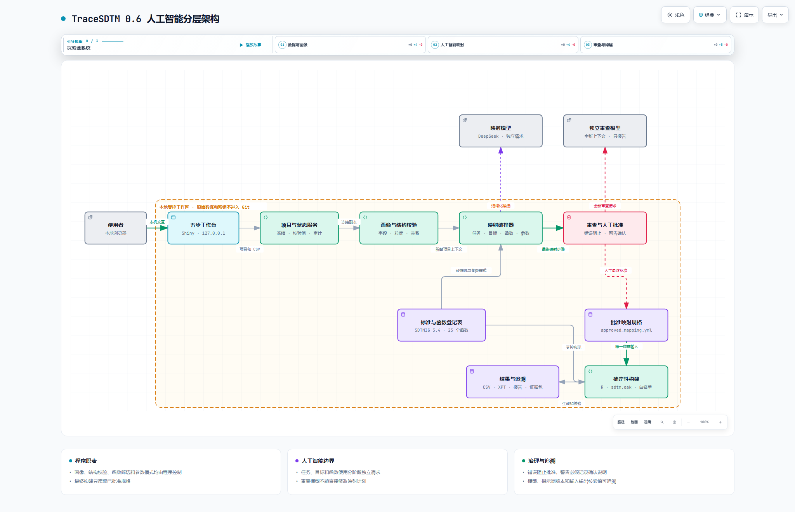

<div align="center">

# TraceSDTM Studio 0.6

**人工监督、程序约束、可追溯的 SDTM 映射与生成工作台**

[](https://www.r-project.org/)
[](https://www.cdisc.org/standards/foundational/sdtmig)
[](#安全边界)
[](LICENSE)

TraceSDTM 把人工智能限制在“提出建议”和“独立审查”两个职责内。画像、结构校验、函数筛选、参数注入、状态控制和最终构建均由程序确定性执行。

</div>

## 项目预览

[](docs/diagrams/trace-sdtm-v06.html)

点击架构图可打开 [Archify 交互式架构图](docs/diagrams/trace-sdtm-v06.html)。图中展示了五步工作台、分阶段模型请求、人工批准边界和确定性构建链路。

<table>
  <tr>
    <td width="50%"></td>
    <td width="50%"></td>
  </tr>
  <tr>
    <td align="center">1. 项目与数据</td>
    <td align="center">2. 任务确认</td>
  </tr>
  <tr>
    <td width="50%"></td>
    <td width="50%"></td>
  </tr>
  <tr>
    <td align="center">3. 映射生成</td>
    <td align="center">4. 审查批准</td>
  </tr>
</table>


## 核心能力

- 导入任意多个 UTF-8 CSV，保留只读原文件，并为每次运行创建冻结副本。
- 根据实际数据生成数据集、字段、日期候选和关联关系画像，不要求预先绑定固定模板。
- 由人工智能发现原子任务；程序检查目标域、来源字段、任务编号、依赖关系和记录粒度后才允许人工冻结任务。
- 将目标变量选择、函数选择和有限参数选择拆成独立请求；人工智能只能从程序提供的标准变量和候选函数中选择。
- 从任务、画像、项目规则和受控资源自动注入参数；自由参数必须通过结构化人工表单填写并再次校验。
- 以全新上下文执行独立人工智能审查。错误阻止批准，警告必须由人工填写说明。
- 最终构建只读取冻结的 `approved_mapping.yml`，通过白名单函数生成 CSV、XPT、字段级追溯、检查结果和证据包。

当前仓库内置 DM、AE 和 VS 元数据，以及 23 个登记转换函数。0.6 工作台不兼容旧版模板项目；旧项目会提示重新创建通用项目。

## 系统架构

程序控制的主流程如下：

```text
来源 CSV 冻结与画像
    ↓
人工智能发现原子任务 → 程序结构校验 → 人工确认并冻结
    ↓
人工智能选择目标变量 → 程序筛选函数 → 人工智能选择候选函数
    ↓
程序自动注入参数 → 有限选项才调用模型 → 自由参数交给人工
    ↓
程序组装映射计划 → 独立人工智能审查 → 人工最终批准
    ↓
批准规格 → 确定性生成 → 本地检查、追溯、报告与证据包
```

架构设计和状态产物说明见 [架构文档](docs/architecture.md)，转换函数契约见 [函数目录](docs/transform_catalog.md)。

## 真实演示结果

仓库内 `data/raw/dm_raw.csv` 用于一次端到端演示。该文件包含 6 条模拟受试者记录和 14 个来源字段；项目研究编号为 `TRACE001`，目标域限定为 DM，未授权向模型发送字段示例值。

| 项目 | 本次结果 |
|---|---:|
| 冻结原子任务 | 17 |
| 最终映射 | 17 |
| 最终有效的 `deepseek-v4-flash` 请求 | 3 次：任务、目标变量、函数各 1 次 |
| 参数模型请求 | 0 次 |
| 人工参数 | 2 组：SITEID 拆分规则、RFSTDTC 日期格式 |
| `deepseek-v4-pro` 独立审查 | 1 次 |
| 审查结果 | 15 项通过、2 项警告、0 项错误 |
| 生成结果 | DM 6 条记录、17 个变量 |
| 本地检查 | 0 个问题 |
| 产物 | CSV、XPT、批准规格、字段追溯、离线报告、证据包均已生成 |

任务草案首次通过程序结构校验；冻结前由人工修正了 DOMAIN 任务的记录粒度。两条审查警告均涉及人工参数来源，已由演示审核者确认后批准。演示审核者标识为 `demo-reviewer`，只说明流程中存在明确的人工决定，不代表法规意义上的专家批准。

调试过程中发现函数筛选和参数解析缺陷，修复后在同一运行中分别重跑了一次目标变量与函数阶段。因此该运行实际产生 6 次接口请求；上表的 4 次是最终有效阶段记录，其中包括 3 次映射请求和 1 次独立审查请求。重跑前的阶段状态保留在本地审计事件中，最终结果只引用重跑后的输入输出校验值。

以上数字来自一次成功运行，只用于证明 0.6 流程能够完整执行，不是模型正确率、稳定性或生产性能的估计。本轮未运行 Pinnacle 21、完整回归测试、性能测试或旧项目兼容测试。

## 技术栈

| 层次 | 主要技术 |
|---|---|
| 本地工作台 | R、Shiny、bslib、DT |
| 数据处理与输出 | dplyr、readr、haven、sdtm.oak |
| 规格与校验 | YAML、JSON Schema Draft-07、内容校验值 |
| 模型接口 | httr2、OpenAI 兼容接口、DeepSeek |
| 审核与审计 | 人工确认、独立模型审查、字段级追溯、离线报告 |
| 架构文档 | Archify 交互式 HTML 与静态图片 |

## 快速启动

需要 R 4.5 或更高版本。首次使用先恢复依赖：

```powershell
Rscript -e "install.packages('renv', repos='https://cloud.r-project.org')"
Rscript -e "renv::restore()"
```

启动只监听 `127.0.0.1` 的本地工作台：

```powershell
.\scripts\start_trace_sdtm_studio.ps1
```

也可以直接运行：

```powershell
Rscript scripts/trace_sdtm.R studio
```

使用 DeepSeek 时，只在当前终端会话中注入密钥：

```powershell
$env:TRACE_SDTM_API_KEY = '<当前会话密钥>'
$env:TRACE_SDTM_BASE_URL = 'https://api.deepseek.com'
$env:TRACE_SDTM_MODEL = 'deepseek-v4-flash'
$env:TRACE_SDTM_REVIEW_MODEL = 'deepseek-v4-pro'
$env:TRACE_SDTM_THINKING_MODE = 'disabled'
.\scripts\start_trace_sdtm_studio.ps1
```

不要把接口密钥写入源码、配置、日志、截图或提交记录。完整操作见 [工作台用户手册](docs/studio_user_guide.md)，五步演示见 [演示说明](docs/demo.md)。

## 目录结构

```text
R/
├─ studio_*            五步界面、项目状态、后台任务、审核和导出
├─ profile.R           数据集、字段与关系画像
├─ task_discovery.R    任务发现、结构校验与冻结
├─ model_gateway.R     公共模型接口与结构化响应读取
├─ mapping_stages.R    目标变量、函数和有限参数选择
├─ parameter_resolvers.R  参数自动注入
├─ mapping_review.R    映射审核表与批准规格组装
├─ registry.R          函数契约、规格校验与内部编译
├─ transforms.R        23 个受控转换函数
└─ build.R             确定性生成与字段级追溯
config/                当前配置、工作台配置和转换函数注册表
data/raw/              DM、AE、VS 模拟上传示例
specs/
├─ sdtm_metadata.yml   当前标准元数据
└─ resources/          公共受控术语与单位换算资源
docs/                  架构、演示、用户手册和截图
scripts/               命令行入口和本地启动器
tests/                 当前 0.6 加载与最小流程检查
workspace/projects/    本地项目和运行产物，Git 默认忽略
```

旧基准数据、金标准、评价脚本和旧版工作台示例已移至
[`archive/legacy-benchmarks`](https://github.com/xiecharlie2002-collab/Trace-SDTM/tree/archive/legacy-benchmarks)
分支。主分支只保留当前工作台及其运行所需的公共资源。

## 安全边界

- 默认不向模型发送完整原始记录或示例值；标识符、受试者键和中心字段始终排除。
- 接口密钥只保存在当前进程或 Shiny 会话内存中，不写入调用审计记录。
- 模型不能生成或执行 R 代码、自由公式、正则表达式或连接键，也不能绕过函数白名单和参数模式。
- 模型审查只能报告问题，不能直接修改映射；未经人工批准的规格不能构建。
- 每次模型请求记录模型名称、提示词版本、输入输出校验值、调用次数和失败原因，以便复核。
- 本项目是本地单用户研究原型，不是经过计算机化系统验证的生产平台，也不生成完整法规提交包。

项目不包含 Define-XML、aCRF、完整试验设计域、ADaM、TLF、电子签名或多用户权限。所有输出仍需由具备相应资质的临床数据标准专家审核。仓库中的数据均为模拟数据，不对应真实受试者；数据边界见 [数据来源说明](DATA_SOURCES.md)，安全报告方式见 [安全说明](SECURITY.md)。

## 许可证

本项目采用 [MIT 许可证](LICENSE)。
