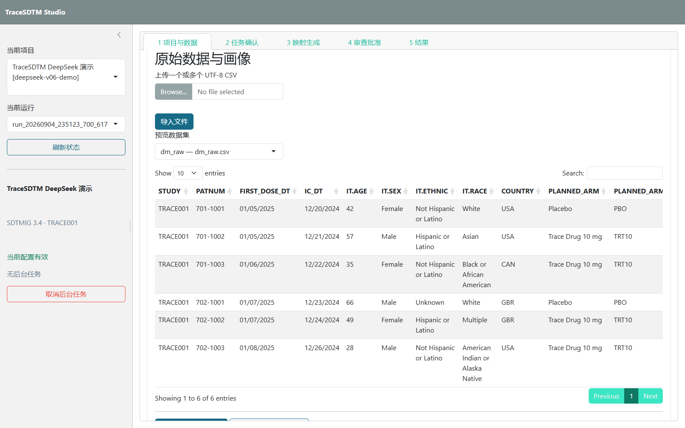
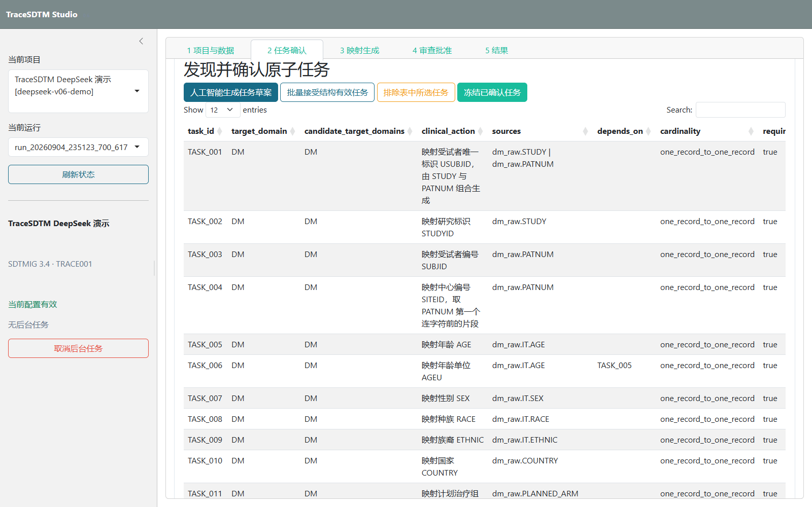
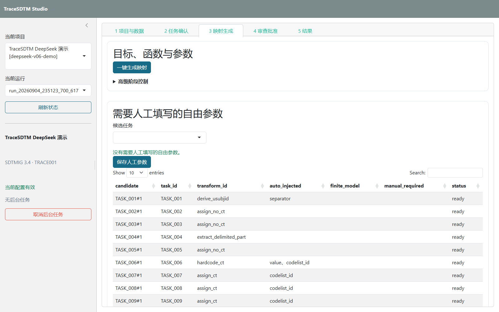
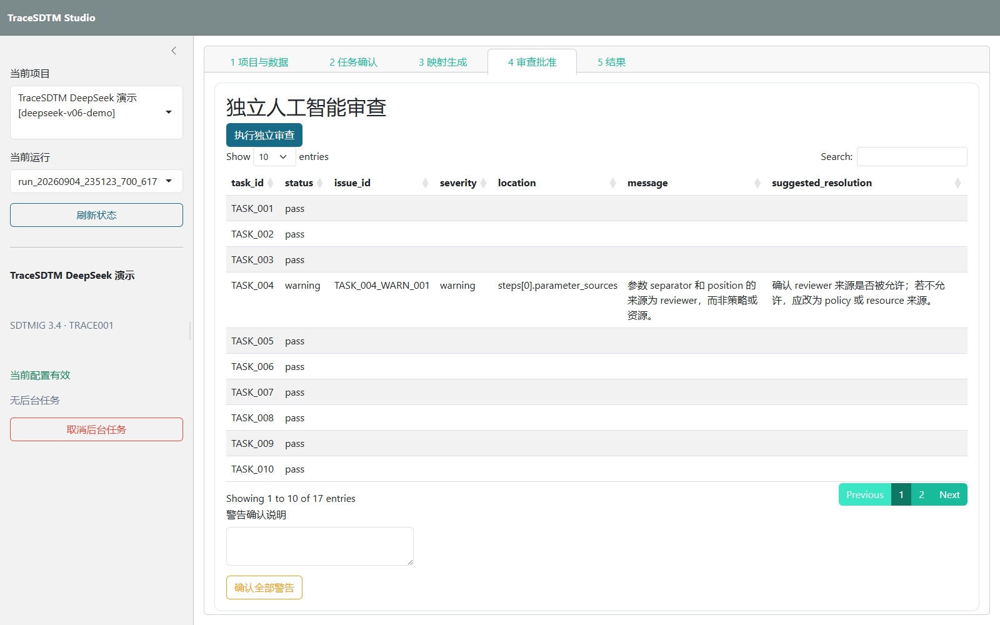
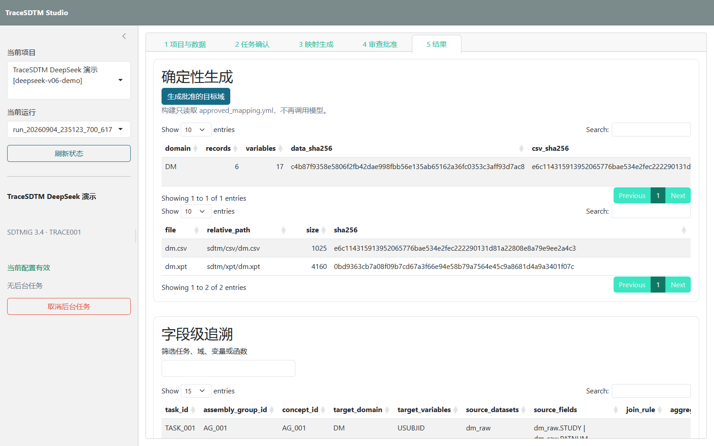

<div align="center">

# TraceSDTM Studio 0.7

**人工监督的 SDTM 映射，以及确定性的 ADaM 与汇总表工作台**

[](https://www.r-project.org/)
[](https://www.cdisc.org/standards/foundational/sdtmig)
[](#安全边界)
[](LICENSE)

TraceSDTM 把人工智能限制在 SDTM 的“提出候选”和“独立审查”两个职责内。批准后的 SDTM、ADSL、ADAE 与两张汇总表均由冻结规则确定性生成。

</div>

## 项目预览

[](docs/diagrams/trace-sdtm-v07-simple.html)

点击架构图可打开交互式架构图。0.7 保留五个主步骤，并在第 5 步中增加 SDTM、ADaM 和汇总表三个结果分区。

<table>
  <tr>
    <td width="50%"></td>
    <td width="50%"></td>
  </tr>
  <tr>
    <td align="center">1. 项目与数据</td>
    <td align="center">2. 任务确认</td>
  </tr>
  <tr>
    <td width="50%"></td>
    <td width="50%"></td>
  </tr>
  <tr>
    <td align="center">3. 映射生成</td>
    <td align="center">4. 审查批准</td>
  </tr>
</table>



## 核心能力

- 导入任意多个 UTF-8 CSV，保留只读原文件，并为每次运行创建冻结副本。
- 根据实际数据生成数据集、字段、日期候选和关联关系画像，不要求预先绑定固定模板。
- 由人工智能发现原子任务；程序检查目标域、来源字段、任务编号、依赖关系和记录粒度后才允许人工冻结任务。
- 将目标变量选择、函数选择和有限参数选择拆成独立请求；人工智能只能从程序提供的标准变量和候选函数中选择。
- 从任务、画像、项目规则和受控资源自动注入参数；自由参数必须通过结构化人工表单填写并再次校验。
- 以全新上下文执行独立人工智能审查。错误阻止批准，警告必须由人工填写说明。
- 最终构建只读取冻结的 `approved_mapping.yml`，通过白名单函数生成 CSV、XPT、字段级追溯、检查结果和证据包。
- 通过 JSON Schema 校验并冻结 `analysis_plan.yml`；分析规格只允许登记规则编号，不允许自由 R 表达式。
- 从 DM 确定性生成 ADSL，从 AE 与 ADSL 生成 ADAE；治疗中出现事件规则由 `admiral` 1.5.0 执行。
- 从同一个规范化结果对象输出两张汇总表的 CSV、HTML 和 RTF，RTF 由 `r2rtf` 1.3.1 生成。

当前仓库内置 DM、AE 和 VS 共 51 个项目元数据变量，以及 23 个登记转换函数。0.7 保持 0.6 项目、运行和批准映射结构可读；没有分析规格的既有项目仍可按 SDTM-only 模式使用。

## 系统架构

程序控制的主流程如下：

```text
来源 CSV 冻结与画像
    ↓
人工智能发现原子任务 → 程序结构校验 → 人工确认并冻结
    ↓
人工智能选择目标变量 → 程序筛选函数 → 人工智能选择候选函数
    ↓
程序自动注入参数 → 有限选项才调用模型 → 自由参数交给人工
    ↓
程序组装映射计划 → 独立人工智能审查 → 人工最终批准
    ↓
批准规格 → 确定性生成三域 SDTM → 本地检查
    ↓
冻结分析规格 → ADSL、ADAE → 两张汇总表 → 三级追溯、报告与证据包
```

架构设计和状态产物说明见 [架构文档](docs/architecture.md)，转换函数契约见 [函数目录](docs/transform_catalog.md)。

## 已复现的确定性演示结果

仓库内的 DM、AE 和 VS 均为自行构造的模拟数据。`demo_three_domain_approved_mapping()` 提供不依赖外部模型的批准映射样例，用于持续集成和离线复现；分析阶段始终不调用模型。

完整的三域清单、ADSL/ADAE 预览和两张表截图见 [公开演示结果](docs/demo_results.md)。

| 项目 | 本次结果 |
|---|---:|
| 三域批准映射样例 | 50 个原子任务，覆盖 51 个目标变量 |
| SDTM | DM 6×18、AE 9×17、VS 60×16 |
| ADaM | ADSL 6×19、ADAE 9×30 |
| 治疗中出现事件 | 7 条事件；5 名受试者至少发生一次 |
| T14.1.1 | 按计划治疗组和总体汇总意向治疗人群的人口学特征 |
| T14.3.1 总体行 | 安慰剂 1/2（50.0%）；试验药 4/4（100.0%）；总体 5/6（83.3%） |
| 本地检查 | SDTM、ADaM、汇总表检查均为 0 个问题 |
| Pinnacle 21 Community | 4.2.0.5013 实际运行完成；FDA 2508.1 共报告 30 个范围内预期问题，DM、AE、VS 无 Reject |
| 输出 | SDTM/ADaM CSV、XPT；表格 CSV、HTML、RTF；三级追溯与校验值 |

上述结果已由完整自动化测试和一次确定性分析运行复现。Pinnacle 21 Community 使用 SDTMIG 3.4、FDA 2508.1 规则及 2026-03-27 受控术语版本完成实际运行；30 个明细均被归入当前演示范围内的预期问题，包括未提供 Define-XML 和未生成范围外数据集，因此不表述为“验证通过”。模型辅助的三域五步演示只有在实际配置模型接口并完成人工修订、审查和批准后才会记录结果；本次环境未配置模型凭据。

## 技术栈

| 层次 | 主要技术 |
|---|---|
| 本地工作台 | R、Shiny、bslib、DT |
| 数据处理与输出 | dplyr、readr、haven、sdtm.oak、admiral 1.5.0、r2rtf 1.3.1 |
| 规格与校验 | YAML、JSON Schema 2020-12、内容校验值 |
| 模型接口 | httr2、OpenAI 兼容接口、DeepSeek |
| 审核与审计 | 人工确认、独立模型审查、字段级追溯、离线报告 |
| 架构文档 | Archify 交互式 HTML 与静态图片 |

## 快速启动

需要 R 4.5 或更高版本。首次使用先恢复依赖：

```powershell
Rscript -e "install.packages('renv', repos='https://cloud.r-project.org')"
Rscript -e "renv::restore()"
```

启动只监听 `127.0.0.1` 的本地工作台：

```powershell
.\scripts\start_trace_sdtm_studio.ps1
```

也可以直接运行：

```powershell
Rscript scripts/trace_sdtm.R studio
```

使用 DeepSeek 时，只在当前终端会话中注入密钥：

```powershell
$env:TRACE_SDTM_API_KEY = '<当前会话密钥>'
$env:TRACE_SDTM_BASE_URL = 'https://api.deepseek.com'
$env:TRACE_SDTM_MODEL = 'deepseek-v4-flash'
$env:TRACE_SDTM_REVIEW_MODEL = 'deepseek-v4-pro'
$env:TRACE_SDTM_THINKING_MODE = 'disabled'
.\scripts\start_trace_sdtm_studio.ps1
```

不要把接口密钥写入源码、配置、日志、截图或提交记录。完整操作见 [工作台用户手册](docs/studio_user_guide.md)，五步演示见 [演示说明](docs/demo.md)。

## 目录结构

```text
R/
├─ studio_*            五步界面、项目状态、后台任务、审核和导出
├─ profile.R           数据集、字段与关系画像
├─ task_discovery.R    任务发现、结构校验与冻结
├─ model_gateway.R     公共模型接口与结构化响应读取
├─ mapping_stages.R    目标变量、函数和有限参数选择
├─ parameter_resolvers.R  参数自动注入
├─ mapping_review.R    映射审核表与批准规格组装
├─ registry.R          函数契约、规格校验与内部编译
├─ transforms.R        23 个受控转换函数
├─ build.R             三域 SDTM 与字段级追溯
├─ adam_build.R        ADSL、ADAE 与变量级追溯
├─ adam_validate.R     ADaM 本地规则检查
└─ tlf.R               两张汇总表及三种格式输出
config/                当前配置、工作台配置和转换函数注册表
data/raw/              DM、AE、VS 模拟上传示例
specs/
├─ sdtm_metadata.yml   三域项目元数据
├─ analysis_plan.yml   冻结分析规则与表壳样例
├─ analysis_plan.schema.json
└─ resources/          公共受控术语与单位换算资源
docs/                  架构、演示、用户手册和截图
scripts/               命令行入口和本地启动器
tests/                 三域、ADaM、汇总表、异常场景与兼容检查
workspace/projects/    本地项目和运行产物，Git 默认忽略
```

旧基准数据、金标准、评价脚本和旧版工作台示例已移至
[`archive/legacy-benchmarks`](https://github.com/xiecharlie2002-collab/Trace-SDTM/tree/archive/legacy-benchmarks)
分支。主分支只保留当前工作台及其运行所需的公共资源。

## 安全边界

- 默认不向模型发送完整原始记录或示例值；标识符、受试者键和中心字段始终排除。
- 接口密钥只保存在当前进程或 Shiny 会话内存中，不写入调用审计记录。
- 模型不能生成或执行 R 代码、自由公式、正则表达式或连接键，也不能绕过函数白名单和参数模式；模型不参与 ADaM 派生或统计计算。
- 模型审查只能报告问题，不能直接修改映射；未经人工批准的规格不能构建。
- 每次模型请求记录模型名称、提示词版本、输入输出校验值、调用次数和失败原因，以便复核。
- 本项目是本地单用户研究原型，不是经过计算机化系统验证的生产平台，也不生成完整法规提交包。

项目不包含 Define-XML、aCRF、EX、ADVS、图形、列表、完整递交包、电子签名或多用户权限。本地规则检查不等同于完整 ADaM/CDISC 合规验证。所有输出仍需由具备相应资质的临床数据标准与统计编程人员审核。仓库中的数据均为模拟数据，不对应真实受试者；数据边界见 [数据来源说明](DATA_SOURCES.md)，安全报告方式见 [安全说明](SECURITY.md)。

## 许可证

本项目采用 [MIT 许可证](LICENSE)。
