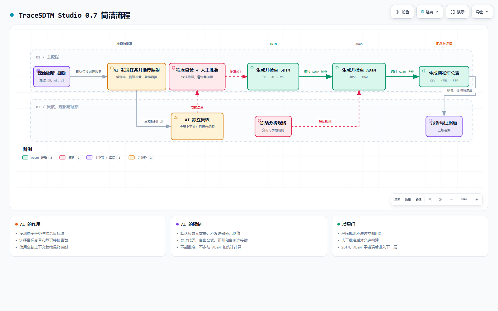

# TraceSDTM Studio 0.7 架构与职责边界

[](diagrams/trace-sdtm-v07-simple.html)

上图由 Archify 根据仓库实现生成，并通过展示级 9 项校验。点击图片可打开交互式 HTML。

```text
本地浏览器（127.0.0.1）
        ↓
项目服务：通用项目、多文件上传、运行快照、状态和审计
        ↓
公开、模拟或使用者上传的来源数据
        ↓
程序生成数据集、字段、候选键、记录粒度与关系画像
    ↓
任务发现模型提出原子任务及候选目标域
    ↓
程序结构校验 → 最多两次定向修订 → 人工确认并冻结
        ↓
第一阶段模型：识别输出种类和目标变量
        ↓
程序按目标域、输出形式、来源数量、字段类型、数据集数量和已知前置条件筛选
    ↓
第二阶段模型：从剩余注册函数中选择函数与来源编号
        ↓
政策、注册表和资源目录注入已经确定的参数
        ↓
第三阶段模型：只补全仍未知且具有有限合法选项的参数；自由参数由人工填写
    ↓
确定性组装并逐任务隔离失败
    ↓
全新上下文的独立人工智能审查，只报告问题
    ↓
人工审核候选方案、确认警告并最终批准
        ↓
批准的 schema_version 0.6 YAML
        ↓
受控 R 调度表 + 选择性 sdtm.oak 算法 + 版本化单位表
        ↓
DM、AE、VS 的 CSV、XPT、追溯和运行清单
        ↓
本地规则检查 + 可选 Pinnacle 21 Community
        ↓
经 JSON Schema 校验并随运行冻结的 analysis_plan.yml
        ↓
DM → ADSL；AE + ADSL → ADAE（admiral 1.5.0）
        ↓
人口学特征表 + 治疗中出现不良事件表
        ↓
同一规范化结果 → CSV、HTML、RTF（r2rtf 1.3.1）
        ↓
SDTM、ADaM、表格三级追溯与不含原始输入的证据包
```

模型没有代码执行权限，也不能发明来源字段、连接键、单位公式、正则表达式或自由条件。来源字段使用稳定的 `ref_id`，模型不能自行拼写数据集前缀。模型分值只用于安排审核顺序。

人工审核不是形式上的确认。`accept` 接受完整候选；`modify` 必须提供能够通过注册表检查的完整步骤；必需任务不能直接拒绝；信息不足未解决时不能批准。

正式构建不读取自然语言理由，也不调用模型。SDTM 转换函数和参数解析器只能从 R 中的受控绑定表解析；ADaM 与表格只能执行分析规格登记的规则编号。模型不会生成分析规则或统计代码。

Shiny网页、命令行和后台子进程都调用同一项目服务、注册表校验器与转换实现。`callr`与`processx`负责一次一个后台任务；运行清单记录完成、失败、取消和中断状态；项目锁防止网页和命令行并发写入。

每个项目冻结标准资源，每次从画像开始创建新的运行快照。分析规格在项目级导入，通过 JSON Schema 校验后随运行冻结并记录校验值；修改分析规格会使当前运行过期。未配置分析规格的 0.6 项目保持 SDTM-only 行为。

模型密钥只存在于当前会话内存并通过环境变量传给子进程。默认请求只含元数据；示例值必须逐字段授权，标识符、键与中心字段始终排除。证据包不包含原始上传文件或字段示例值。

当前项目元数据覆盖 DM、AE、VS 共 51 个变量；分析范围限于 ADSL、ADAE、人口学特征表和治疗中出现不良事件表。Define-XML、aCRF、EX、ADVS、图形、列表、多用户权限、电子签名、CDISC CORE 和法规申报级系统验证不在 0.7 范围内。本地规则检查不能表述为完整 CDISC 合规验证。
