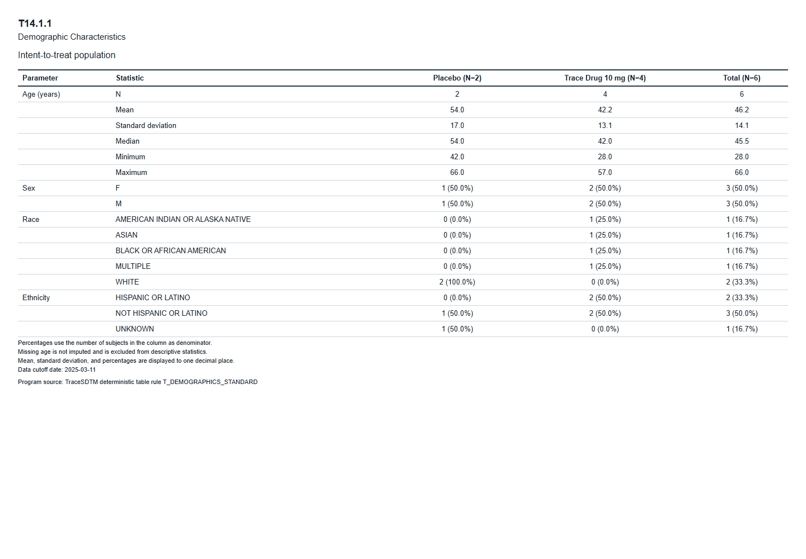
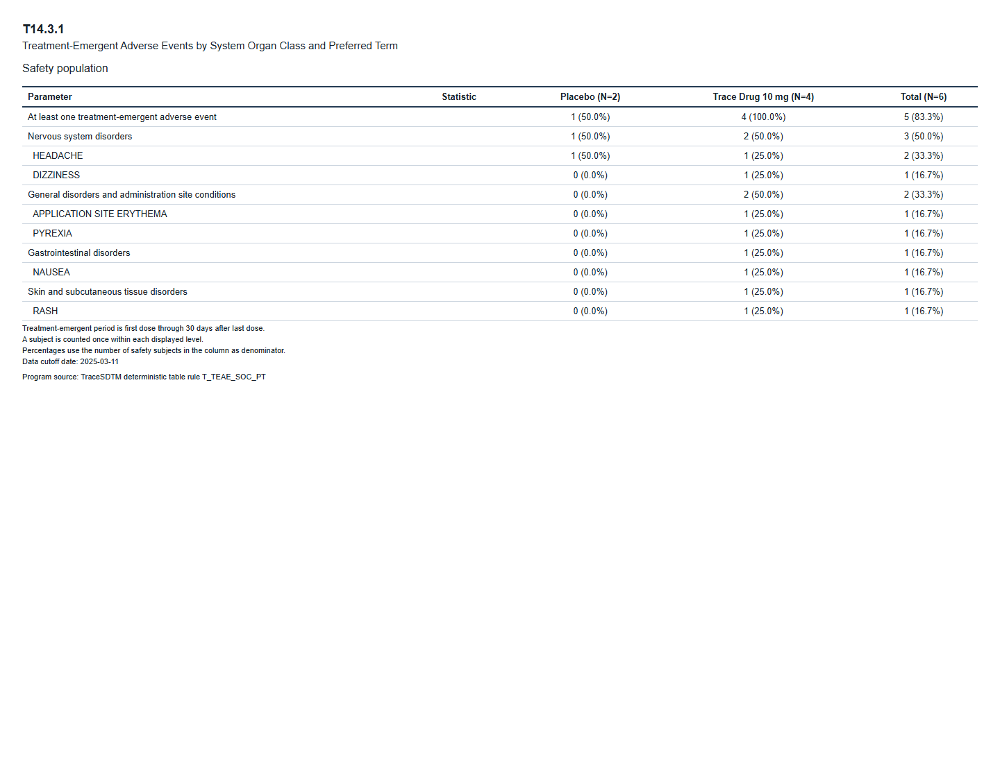

# TraceSDTM 0.7 公开演示结果

本页结果来自仓库模拟数据、三域批准映射样例和冻结分析规格。它证明确定性流程可复现，不代表正式递交级验证。

## 三域 SDTM 清单

| 数据集 | 记录数 | 变量数 |
|---|---:|---:|
| DM | 6 | 18 |
| AE | 9 | 17 |
| VS | 60 | 16 |

三域合计 51 个项目元数据变量，本地规则检查未发现问题。Pinnacle 21 Community 4.2.0.5013 已使用 FDA 2508.1 规则实际运行，共报告 30 个当前演示范围内的预期问题，DM、AE、VS 没有 Reject；由于未提供 Define-XML 且未生成范围外数据集，本项目不将该结果表述为“验证通过”。

## ADSL 预览

| USUBJID | AGE | SEX | TRT01P | TRTSDT | TRTEDT | ITTFL | SAFFL |
|---|---:|---|---|---|---|---|---|
| TRACE001-701-1001 | 42 | F | Placebo | 2025-01-05 | 2025-02-02 | Y | Y |
| TRACE001-701-1002 | 57 | M | Trace Drug 10 mg | 2025-01-05 | 2025-02-02 | Y | Y |
| TRACE001-701-1003 | 35 | F | Trace Drug 10 mg | 2025-01-06 | 2025-02-03 | Y | Y |
| TRACE001-702-1001 | 66 | M | Placebo | 2025-01-07 | 2025-02-04 | Y | Y |
| TRACE001-702-1002 | 49 | F | Trace Drug 10 mg | 2025-01-07 | 2025-02-04 | Y | Y |
| TRACE001-702-1003 | 28 | M | Trace Drug 10 mg | 2025-01-08 | 2025-02-05 | Y | Y |

ADSL 为每名受试者一条记录，共 6 条、19 个变量。

## ADAE 关键变量预览

| USUBJID | AESEQ | AEDECOD | ASTDT | TRTEMFL | 说明 |
|---|---:|---|---|---|---|
| TRACE001-701-1001 | 1 | HEADACHE | 2025-01-06 | Y | 治疗中出现 |
| TRACE001-701-1002 | 1 | NAUSEA | 2025-01-06 | Y | 治疗中出现 |
| TRACE001-701-1002 | 2 | APPLICATION SITE ERYTHEMA | 2025-01-09 | Y | 治疗中出现 |
| TRACE001-701-1003 | 1 | DIZZINESS | 2025-01-08 | Y | 治疗中出现 |
| TRACE001-702-1001 | 1 | FATIGUE | 2025-01-03 |  | 首次给药前 |
| TRACE001-702-1002 | 1 | RASH | 2025-01-11 | Y | 治疗中出现 |
| TRACE001-702-1002 | 2 | COUGH | 2025-03-10 |  | 末次给药后 30 天窗口外 |
| TRACE001-702-1003 | 1 | HEADACHE | 2025-01-09 | Y | 治疗中出现 |
| TRACE001-702-1003 | 2 | PYREXIA | 2025-01-12 | Y | 治疗中出现 |

ADAE 与 AE 同为 9 条记录，其中 7 条 `TRTEMFL=Y`，2 条为空。事件日期不填补。

## T14.1.1 人口学特征汇总表

## T14.3.1 治疗中出现不良事件汇总表

总体行结果为：安慰剂 1/2（50.0%），试验药 4/4（100.0%），总体 5/6（83.3%）。每名受试者在总体、系统器官分类和首选术语层级内均只计数一次。
